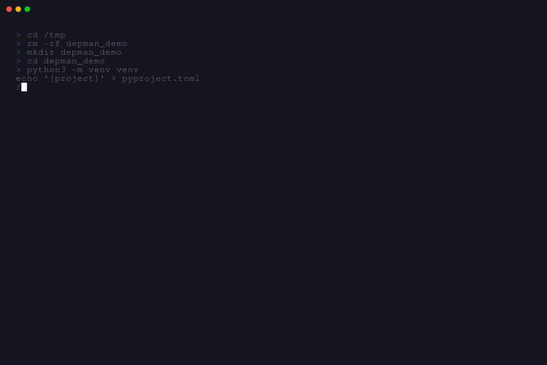

# depman 🐍

[](https://opensource.org/licenses/MIT)
[](https://go.dev/)
[](https://github.com/charmbracelet/bubbletea)
[](https://github.com/eslam/depman/releases/latest)
[](https://github.com/eslam/depman/actions)
[](https://goreportcard.com/report/github.com/eslam/depman)

A keyboard-first Terminal User Interface (TUI) for managing Python project dependencies. Built with Go, Bubble Tea, and Lip Gloss.



## Why depman?

Managing Python dependencies often feels like a context-switching marathon. You're jumping between `pip install`, `pip list --outdated`, and manually editing `pyproject.toml` or `requirements.txt`.

**depman** brings everything into one unified, keyboard-driven workflow. See what's outdated, search PyPI, and update your environment without ever reaching for your mouse or leaving your terminal.

## Key Features

- **Auto-Detection** - Instantly finds `pyproject.toml` or `requirements.txt` and your virtual environment
- **Lightning Fast** - Powered by `uv` (falls back to `pip`) for near-instant package operations
- **Vim-Native** - Navigate with `h/j/k/l`, jump with `gg/G`, and search with `/`
- **Visual Semver** - Color-coded updates (🟢 patch, 🟡 minor, 🔴 major) let you assess risk at a glance
- **Real-time Search** - Search PyPI with live results and package descriptions
- **Tokyo Night Theme** - A beautiful, eye-friendly dark theme out of the box


## Prerequisites

- Python 3.8+ with a virtual environment (venv, uv venv, or poetry)
- Optional: [uv](https://github.com/astral-sh/uv) for faster package operations (recommended)
- Optional: [go](https://go.dev/) 1.25+ (only if building from source)

## Installation

### Binary (Recommended)

Download the latest binary for your platform from the [Releases](https://github.com/eslam/depman/releases) page.

```bash
# Linux (x86_64)
curl -L -o depman https://github.com/eslam/depman/releases/latest/download/depman-linux-amd64
chmod +x depman
sudo mv depman /usr/local/bin/

# macOS (Apple Silicon)
curl -L -o depman https://github.com/eslam/depman/releases/latest/download/depman-darwin-arm64
chmod +x depman
sudo mv depman /usr/local/bin/

# macOS (Intel)
curl -L -o depman https://github.com/eslam/depman/releases/latest/download/depman-darwin-amd64
chmod +x depman
sudo mv depman /usr/local/bin/
```

### Homebrew (macOS / Linux)

```bash
# Tap the repository (if available)
brew tap eslam/depman
brew install depman

# Or install from source
brew install --build-from-source depman
```

### AUR (Arch Linux)

Using your favorite AUR helper (yay, paru, etc.):

```bash
# Using yay
yay -S depman

# Using paru
paru -S depman
```

### From Source

Requires [Go](https://go.dev/) 1.25 or later.

```bash
# Clone the repository
git clone https://github.com/eslam/depman.git
cd depman

# Build
go build -o depman .

# Or install directly
go install .
```

## Quick Start

Just run `depman` in the root of your Python project:

```bash
depman
```

If no project is found, `depman` will help you initialize one.

## Keybindings

<details>
<summary><strong>Navigation</strong> (click to expand)</summary>

| Key | Action |
|-----|--------|
| `j` / `↓` | Move down |
| `k` / `↑` | Move up |
| `g` | Go to first item |
| `G` | Go to last item |
| `Ctrl+d` | Page down |
| `Ctrl+u` | Page up |
| `Tab` | Switch between panels |

</details>

<details>
<summary><strong>Package Operations</strong> (click to expand)</summary>

| Key | Action |
|-----|--------|
| `a` | Add a new package |
| `d` / `x` | Remove selected package |
| `u` | Update selected package |
| `U` | Update all outdated packages |

</details>

<details>
<summary><strong>Search & Help</strong> (click to expand)</summary>

| Key | Action |
|-----|--------|
| `/` / `s` | Search PyPI online |
| `?` | Show help menu |
| `q` / `Esc` | Quit |

</details>

## Configuration

`depman` looks for a configuration file at `~/.config/depman/config.toml`.

```toml
# Preferred package manager: "uv" or "pip"
package_manager = "uv"

# Log level: "debug", "info", "warn", "error"
log_level = "info"
```

## Environment Variables

| Variable | Description | Default |
|----------|-------------|---------|
| `XDG_CONFIG_HOME` | Base directory for config files | `~/.config` |
| `VIRTUAL_ENV` | Python virtual environment path | Auto-detected from project |

### Examples

```bash
# Use custom config directory
export XDG_CONFIG_HOME=/etc/config
depman

# With virtual environment activated (auto-detected)
source .venv/bin/activate
depman
```

## FAQ & Troubleshooting

<details>
<summary>"No Python project found" error</summary>

Make sure you're running `depman` from a directory containing:
- `pyproject.toml`
- `requirements.txt`
- `setup.py`
- Or activate a virtual environment with `source .venv/bin/activate`

</details>

<details>
<summary>How do I use a custom PyPI mirror?</summary>

Add to your `~/.config/depman/config.toml`:

```toml
[pypi]
mirror = "https://pypi.tuna.tsinghua.edu.cn/simple"
```

</details>

<details>
<summary>How do I switch between pip and uv?</summary>

Update your config:

```toml
[package_manager]
preferred = "pip"  # or "uv"
```

Or leave empty for auto-detection (uv is preferred if available).

</details>

<details>
<summary>depman is slow with large projects</summary>

- Use `uv` instead of `pip` for much faster operations
- Enable debug logging to see operation timing: `log_level = "debug"`
- Consider pinning critical dependencies to reduce update checks

</details>

<details>
<summary>Keyboard shortcuts not working</summary>

Make sure you're in Normal mode (not Insert mode). Press `Esc` to return to Normal mode.

</details>

<details>
<summary>How do I contribute to depman?</summary>

See the [Contributing](#contributing) section below. We welcome:
- Bug reports
- Feature requests
- Pull requests
- Documentation improvements

</details>

## Development

### Prerequisites

- Go 1.25+
- Python 3.8+ with a virtual environment

### Running Tests

```bash
# Run all tests
go test ./...

# Run tests with coverage
go test -cover ./...

# Run a specific test
go test -run TestFunctionName ./...
```

### Building

```bash
go build -o depman .
```

### Linting

```bash
go vet ./...
go fmt ./...
```

## Tech Stack

- **TUI Framework**: [Bubble Tea](https://github.com/charmbracelet/bubbletea) - Interactive CLI framework
- **Styling**: [Lip Gloss](https://github.com/charmbracelet/lipgloss) - Style definition library
- **Language**: [Go](https://go.dev/) - 1.25+ required
- **Config**: [go-toml](https://github.com/pelletier/go-toml) - TOML parsing
- **Python API**: [PyPI](https://pypi.org) - Package metadata and search

### Dependencies

- `charmbracelet/bubbletea` - TUI framework
- `charmbracelet/lipgloss` - Terminal styling
- `pelletier/go-toml` - Configuration parsing

## Contributing

Contributions are welcome! Whether it's a bug report, a feature request, or a pull request, feel free to get involved.

1. Fork the repository
2. Create your feature branch (`git checkout -b feature/amazing-feature`)
3. Commit your changes (`git commit -m 'Add amazing feature'`)
4. Push to the branch (`git push origin feature/amazing-feature`)
5. Open a Pull Request

Please read [CONTRIBUTING.md](CONTRIBUTING.md) for details on our code of conduct and development process.

## Roadmap

- [ ] **Package version pinning support** - Lock specific versions to ensure reproducible builds
- [ ] **Requirements.txt editor** - Visual editor for requirements.txt files with validation
- [ ] **Virtual environment creation/deletion** - Create and manage venvs directly from the UI
- [ ] **Dependency tree visualization** - Visual graph showing package relationships and conflicts
- [ ] **Audit security vulnerabilities** - Integrate with PyUP or similar to highlight vulnerable packages
- [ ] **Multi-language support** - Support package managers for other languages (npm, cargo, gem, etc.)
- [ ] **Plugin system** - Extensible architecture for custom commands and integrations
- [ ] **Theme customization** - More built-in themes and custom theme support

## License

Distributed under the MIT License. See [LICENSE](LICENSE) for more information.

---

Built with ❤️ by [Eslam Mohamed](https://github.com/EslamMohamed365)
